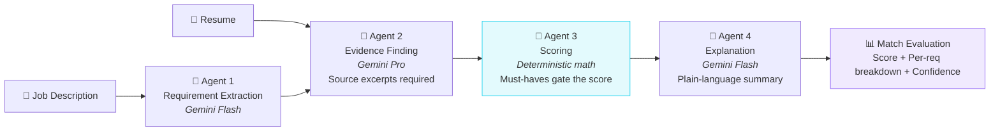
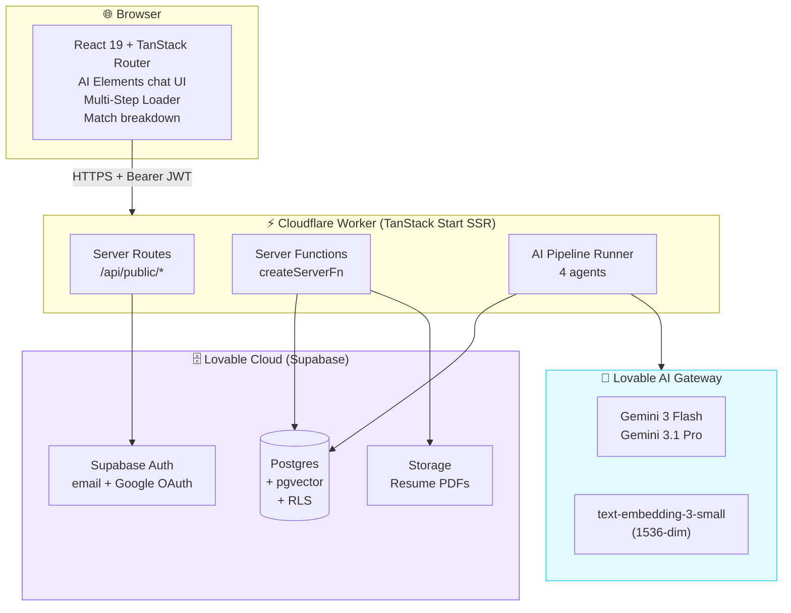
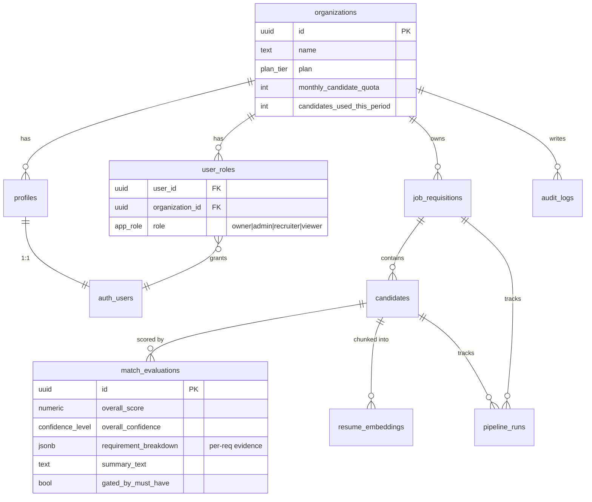
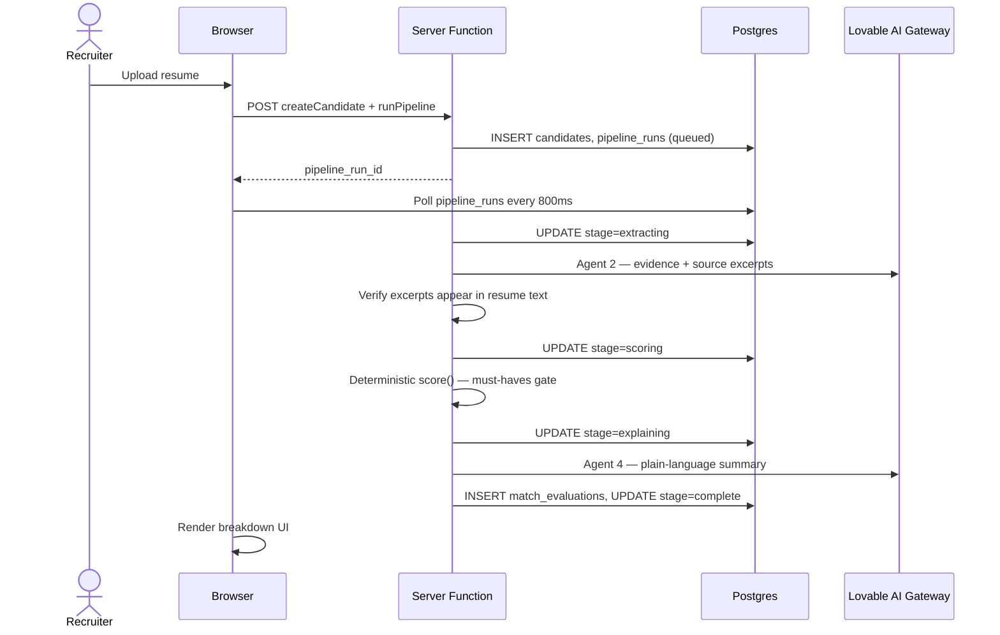

# RecruitIQ

> **The first AI recruiting-match tool that shows its work.**
> Every score comes with a transparent, auditable breakdown of exactly which requirements matched, which didn't, and why — generated by a multi-agent evaluation pipeline instead of a single opaque prompt.

<p align="center">
  
  
  
  
</p>

---

## 📖 Summary

**RecruitIQ** is an explainable AI candidate-matching platform for staffing firms, in-house talent acquisition teams, and RPOs. Where existing "AI recruiter" tools give you a match score and a shrug, RecruitIQ gives you a decision you can defend — to a hiring manager in Slack, to a candidate who asks why they were rejected, or to a regulator asking whether your AI hiring is fair.

## 🎯 The problem — and why now

Recruiters spend 60% of their week on first-pass resume screening. Every existing AI recruiting tool promises to automate this, but recruiters either **ignore the score** (reverting to manual work) or **rubber-stamp it** (destroying accountability). Both outcomes are bad for candidates and companies.

Meanwhile, the EU AI Act classifies hiring AI as *high-risk*, requiring explainability. Emerging US state laws follow. "Black box match score" tools are shifting from nice-to-have-explainability to **compliance liability**.

The gap is not "faster matching." It's **defensible matching**.

## 💡 The solution

A **four-agent pipeline** — deliberately split so each step is verifiable — plus a **deterministic scoring function** so the math is reproducible, not the LLM's mood.



**Three non-negotiable guardrails:**
- **No excerpt, no evidence.** Every match claim must cite the exact resume text. Fabrication is technically impossible.
- **Bias mitigation at the source.** Names, gender-coded pronouns, university prestige stripped before scoring unless explicitly required.
- **Confidence, not false precision.** Low-evidence scores are flagged for manual review, never presented as hard numbers.

## 💰 Does it save time and money?

**Time:** A recruiter screening 200 resumes/week at 3 min/resume = 10 hours/week. RecruitIQ cuts this to a 15-second review of a defensible breakdown — reclaiming **~9 hours/week per recruiter**.

**Money:** At $30/hour recruiter loaded cost, that's **~$1,080/month/recruiter** in reclaimed time. Growth plan ($299/mo, 10 seats) pays for itself in **under a week**.

**Risk:** For regulated hiring (EU AI Act, NYC AEDT, Colorado AI Act), auditable scoring eliminates a category of legal exposure that black-box tools carry.

---

## 🏗️ Architecture

### High-Level Design (HLD)



### Low-Level Design — data model



### Low-Level Design — pipeline sequence



## 🛠️ Tech Stack

| Layer | Choice | Why |
|---|---|---|
| Frontend | React 19 + TanStack Router | Type-safe file-based routing, SSR, edge-deployable |
| Backend | TanStack Start `createServerFn` on Cloudflare Workers | Same-repo RPC, no separate API service |
| Database | Supabase Postgres + pgvector | Tenant isolation via RLS, native vector search |
| Auth | Supabase Auth (email/password + Google OAuth) | Managed, secure, HIBP-check available |
| AI | Lovable AI Gateway (Gemini 3 Flash + 3.1 Pro) | No API key mgmt, aggregated billing, cost visibility |
| Embeddings | OpenAI text-embedding-3-small (1536-dim) | Retrieval quality vs cost balance |
| Storage | Supabase Storage (private, org-scoped) | Same auth model, path-based tenant policies |
| Payments | Lovable Stripe (built-in) | No BYOK Stripe setup |
| Styling | Tailwind CSS v4 + shadcn/ui | Token-driven, dark-first, accessible |
| Deploy | Lovable | One-click publish, stable preview + prod URLs |

## 🗺️ Development Roadmap

### ✅ Built (Turn 1 — Foundations)
- Design system (Bold Tech: violet + cyan + navy, dark-first) with reduced-motion audit
- Full database schema with RLS + GRANTs on every table
- Multi-tenant organizations, `user_roles` (RBAC), signup trigger
- Storage buckets (private, org-scoped): `resumes`, `voice-recordings`
- Landing page (hero, features, pipeline diagram, pricing, footer)
- Marketing pages: `/pricing`, `/how-it-works`, `/security`
- Auth flows: `/auth` (email + Google), `/forgot-password`, `/reset-password`
- SEO: unique per-route metadata, sitemap.xml, robots.txt

### ✅ Built (Turns 2–3 — Core loop)
- Onboarding wizard (`/app/onboarding`) — required before dashboard
- Dashboard (`/app/dashboard`) with KPI stats and recent evaluations
- Jobs (`/app/jobs`) — create, view, requirement-extraction agent
- Resume upload + 4-agent pipeline (extraction → evidence → scoring → explanation)
- Match breakdown UI with per-requirement evidence, confidence, and must-have gating
- Prompt-injection sanitization + PII redaction on all resume text
- Live progress UI (polls `pipeline_runs` while running)

### ✅ Built (Turn 4 — Team, search, embeddings)
- Team management (`/app/team`) — invite by email, RBAC role editor
- Global candidate search (`/app/candidates`) — hybrid Postgres FTS + pgvector fallback
- Resume embeddings pipeline (`text-embedding-3-small`, 1536-dim, chunked)

### ✅ Built (Turn 5 — Growth features)
- **Voice AI pre-screen** — browser MediaRecorder → Supabase Storage → Lovable AI Gateway
  `openai/gpt-4o-mini-transcribe` → Gemini 3 Flash structured summary
  (recommendation, Q&A, compensation, start date, work authorization)
- **ATS integrations** — Greenhouse (Harvest), Lever, Ashby
  - Per-org API key vault (RLS: Owner/Admin only)
  - Live provider validation on connect
  - Job picker + candidate import with de-duplication (`ats_imports` audit trail)
  - Configurable at `/app/integrations`
- PDF export of match reports
- Job progress UI aggregated per requisition

### ✅ Built (Turn 6 — Sync, review, walkthrough, E2E)
- **Per-candidate ATS sync** — `syncAtsCandidate` re-pulls name / email / current stage
  from Greenhouse, Lever, or Ashby and records `last_synced_at` + `external_stage`
  on `ats_imports`; surfaced as an "Imported from …" card on candidate detail
- **Voice → ATS mapping** — `pushVoiceScreenToAts` renders the pre-screen summary,
  recommendation, Q&A, compensation / start date / work authorization and recruiter
  notes into a provider note
  (Greenhouse `activity_feed/notes`, Lever `opportunities/:id/notes`, Ashby `candidate.createNote`);
  sync state stored on `voice_screens.ats_synced_at` / `ats_external_note_id` / `ats_sync_error`
- **Voice review & edit** — recruiters can rewrite the AI summary, add their own notes,
  override the recommendation, and mark the screen reviewed
  (`review_status`, `reviewed_by`, `reviewed_at`, audit-logged)
- **Onboarding walkthrough** — dismissible 4-step "get to your first match" guide on the
  dashboard, driven by live org stats and persisted in `localStorage`
- **Playwright E2E** — `e2e/public-journey.spec.ts` (marketing routes, SEO metadata,
  sitemap/robots, auth gate) and `e2e/recruiter-flow.spec.ts` (sign-in, job creation +
  requirement extraction, integrations, global search); run with `bun run test:e2e`

### ✅ Built (Turn 7 — Finishing the half-built pieces)
- **Job edit & delete** — edit title/description with optional requirement re-extraction;
  soft delete (`deleted_at`) keeps match reports for audit; both audit-logged (`job.updated`, `job.deleted`)
- **Onboarding → first match report** — step 4 uploads a resume or runs a bundled sample resume
  and lands directly on the full breakdown (PRD §5.1 "valuable within seconds")
- **Email verification banner** — non-blocking reminder with "Resend email" (PRD §5.1)
- **Similar past jobs** — keyword-overlap lookup surfaced on new-job and job pages to reuse rubrics (PRD §9.2b)
- **Pipeline retries + error taxonomy** — storage, evidence and summary steps retry 3× with exponential backoff;
  failures carry specific codes (`PDF_NO_TEXT`, `PDF_UNREADABLE`, `EVIDENCE_FAILED`, …) mapped to helpful messages (PRD §7.5, §7.8)
- **PDF export of match reports** — print-optimised report (sidebar, voice and ATS panels hidden) via "Export PDF"

### 🚧 Pending (MVP launch blockers)
- **Billing** — Stripe checkout, Starter $99 / Growth $299, billing page, cancel → read-only free tier with exit survey (PRD §5.4, §6.5)
- **Plan quotas & rate limits** — enforce `monthly_candidate_quota` before scoring; per-plan request limits (PRD §7.7)
- **Settings** — `/app/settings/profile`, `/app/settings/billing`, `/app/settings/api-keys` (PRD §4)
- **Account deletion** — re-auth, warning, 14-day soft-delete grace, anonymised audit retention (PRD §5.2)
- **Password strength meter** on sign-up and reset (PRD §5.2)
- **Scoring engine unit tests** (PRD §10.5 — highest priority)
- **Authenticated E2E run** — spec written; needs a test account (`E2E_USER` / `E2E_PASS`)
- **Semantic job similarity** — upgrade keyword lookup to embeddings of job requirements
- README screenshots (post-first-tenant)

### 🔭 Next (post-MVP)
- **Twilio-backed outbound telephony** for voice pre-screen (currently browser-recorded)
- **SAML SSO** for Scale tier
- **BullMQ-backed pipeline** for high-volume batch imports
- **Audit-log export UI** (table already writes, export deferred)
- **Fallback model** when the primary AI model is unavailable (PRD §9.6)
- **Error monitoring & structured request tracing** (PRD §7.8, §10.3)
- **Custom domain + production-readiness gate** (PRD §10.6)
- **LLM-as-judge eval infra** (PRD §9.5)
- **PostHog analytics funnel**

## 🚀 Getting Started

```bash
# Install
bun install

# Dev server (Lovable auto-runs; only needed for local)
bun dev

# Type check
bunx tsgo --noEmit

# Build
bun run build
```

## 🔐 Security posture

- Row-level security on every multi-tenant table
- Role-based access via separate `user_roles` table (no privilege escalation via profile edit)
- SECURITY DEFINER helpers with `SET search_path = public` and revoked-from-public EXECUTE
- Bearer-token auth middleware validates JWTs server-side
- Resumes stored in private bucket with path-based org isolation
- Prompt-injection sanitization on all resume text before LLM calls
- Source-excerpt verification prevents fabricated evidence
- Deterministic scoring layer makes score manipulation via resume content ineffective

See `/security` in the app and `PRODUCTION_CHECKLIST.md` for the full posture.

## 📄 License

Proprietary — RecruitIQ.

---

<p align="center">
  <em>Built with care for hiring teams who care about fairness.</em>
</p>
